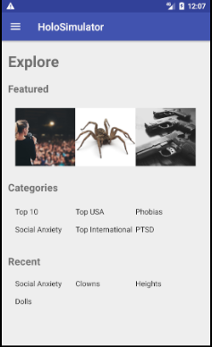
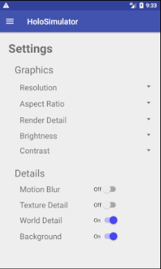
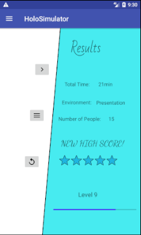
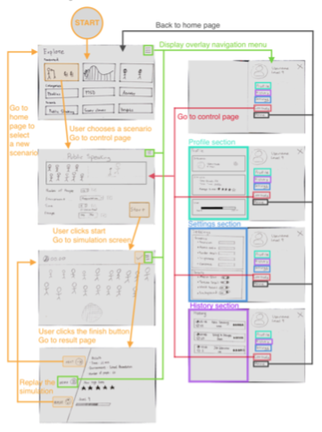

# HoloSimulator
An android application for users to search for simulations which they may virtually enter to help with anxiety issues.
Some functianlity is not implemented. Main purpose was to focus on UI of application.

[Paper Prototype](https://youtu.be/V7k0m1wP1k4)





## Interaction Design



## How to start?
1. Open git shell in folder of your choosing
2. Execute:  
             ``` $ git clone https://github.com/amuna/HoloSimulator.git ```
3. Open Android Studio
4. File > New > Import Project
5. Select the project folder ../../HoloSimulator
6. Run in emulator: Pixel 2 API 22 for device emulation

Note: Important to clone to your laptop via git shell to avoid first time build issues for .iml/gradle build files (Clean and re-build)
